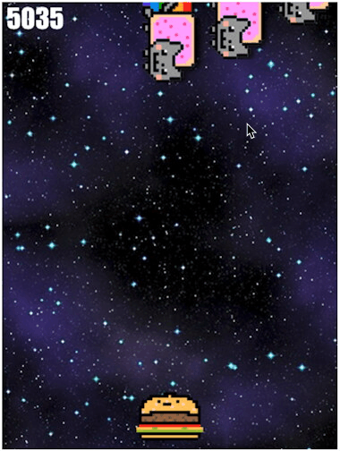

# Taller Juego JavaScript: Gatitos Explosivos

<h2 align="center">¡GATITOS EXPLOSIVOS 🙀💥!</h2>
<p align="center"></p>

## Introducción
Este taller está diseñado como una forma de practicar y aprender sobre Programación Orientada a Objetos en JavaScript. Te entregamos un código que crea un juego _casi_ funcional.

El taller se divide en dos partes: en la primera parte, corregirás e implementarás algunas funcionalidades básicas. En la segunda parte, ¡podrás personalizar el juego como desees! 🔥🔥

La mayor parte de las cosas interesantes ocurren en el archivo `js/gatitos.js`. Este archivo ya contiene una cantidad considerable de código con comentarios.

## Leer código
Como programador, leerás código con la misma o incluso más frecuencia que escribirlo. Debido a esto, la primera parte de este taller se centrará en leer y comprender el código proporcionado. 🤓💻

## El juego
Este juego se llama ¡GATITOS EXPLOSIVOS 💥🙀!. En el juego, juegas como una hamburguesa antropomórfica. Lo único que puedes hacer es moverte hacia la izquierda o hacia la derecha con las flechas de tu teclado. ↔️🍔

El objetivo del juego es mantenerte con vida el mayor tiempo posible evitando los Gatos Nyan que caen del cielo e intentan atraparte. ¡Cuanto más tiempo te mantengas con vida, más alta será tu puntuación! 💪🏻🙌🏻

En este momento, el juego está un poco roto. Este taller te permitirá primero arreglar el juego roto y luego añadir tus propias características 🚀👨🏻‍🚀

## Instrucciones

1. Clona este repositorio, o, si no estás familiarizado con GitHub, descarga el código. Luego abre el archivo `index.html` en tu navegador y observa lo que sucede al cargarlo.
2. Después de leer las instrucciones del proyecto, **echa un vistazo al código proporcionado**. Discútelo con tus compañeros. No te preocupes si no entiendes *todo*, pero trata de tener una idea general de lo que hace el código.
3. Observa que el código utiliza el elemento HTML5 `<canvas>` para dibujar el juego en la pantalla. Puedes familiarizarte con la API de Canvas *según sea necesario* utilizando el [Tutorial de la API de Canvas de MDN](https://developer.mozilla.org/es/docs/Web/API/Canvas_API/Tutorial).
4. Una vez que hayas consultado el código proporcionado, comienza con la sección básica a continuación y avanza a tu propio ritmo.

## Asignaciones básicas

### 1. Arreglar el error de los enemigos
Si observas el juego durante un tiempo, notarás que un enemigo nunca aparece en el extremo izquierdo de la pantalla. Esto se debe a un error que se introdujo intencionalmente en el método `agregarEnemigo` de la clase `MotorDeJuego`. Encuentra el error y arréglalo.

### 2. Hacer que el juego *realmente* termine
Si un Gato Nyan te atrapa y te come, el juego sigue avanzando. ¡Arreglemos esto!

Primero, observa el método `bucleJuego` de la clase `MotorDeJuego`. Hay una parte de la función que llama a `this.jugadorEstaMuerto()` para verificar si el jugador ha muerto según la situación actual.

A continuación, observa el método `jugadorEstaMuerto` de la clase `MotorDeJuego`. Observa que siempre devuelve `false`, lo que significa que el jugador siempre se considera vivo.

Aquí vamos a reescribir el código de esta función para comprobar si el jugador realmente debería estar muerto. Lo haremos recorriendo todos los enemigos en un bucle, comprobando si su cuadro se superpone con el cuadro del jugador.

Si al menos un enemigo se superpone con el jugador, entonces tu función debería devolver `true`. De lo contrario, debería devolver `false`.

Como pista 🕵🏻‍♂️🔎, ten en cuenta que el tamaño de cada enemigo está definido por sus coordenadas `x` e `y` y las constantes `ENEMIGO_ANCHO` y `ENEMIGO_ALTURA`. Hay variables similares para el jugador.

### 3. Refactorizar algo de código (OPCIONAL)
Refactorizar el código es la acción de reorganizar y/o reescribir ese código manteniendo la funcionalidad intacta.

Observa las clases `Jugador` y `Enemigo` y observa que sus métodos `render` son idénticos. Esto viola un principio de programación llamado "DRY: Don't Repeat Yourself" (No te repitas). ¡Arreglemos esto!

Aunque hay muchas formas de solucionarlo, aquí lo haremos creando una superclase llamada `Entidad`. Esta superclase no necesitará un constructor y solo tendrá el método `render`.

Luego, haremos que `Jugador` y `Enemigo` extiendan la clase `Entidad` y eliminaremos los métodos `render` de ambas clases.

Habiendo realizado esta manipulación, nuestros constructores se habrán roto. Asegúrate de arreglarlo llamando a la función `super` desde tus constructores.

Como pista, el código se volvera algo así:

```js
class Entidad {
  render() {
    // ...
  }
}

class Enemigo extends Entidad {
  // ...
}

class Jugador extends Entidad {
  // ...
}
```

---

### 4. ¡Dale tu toque personal!

¡Haber completado la sección básica de este proyecto ya es genial! Sin embargo, esto te dejará mucho tiempo para la parte divertida: personalizar y evolucionar el juego. Como esta es una actividad abierta, te daremos algunas sugerencias. Siéntete libre de utilizarlas o no.

Aquí tienes un ejemplo de un juego personalizado por uno de mis estudiantes, Nathaniel Kitzke: https://ziad-saab.github.io/nyan-cat-game/

#### Algunas sugerencias...

* En lugar de detener por completo el juego cuando termina, permite al jugador iniciar un nuevo juego.
* Agrega una banda sonora y efectos de sonido al juego.
* Agrega la posibilidad de tener vidas.
* Haz que los gatitos explotan al matar el jugador.
* Aumenta el nivel de dificultad del juego a medida que pasa el tiempo, haciendo que los enemigos se muevan más rápido.
* Permite que los enemigos y el jugador tengan sprites animados en lugar de los actuales estáticos. Puedes hacer esto definiendo un sprite como un arreglo de imágenes y estableciendo una velocidad a la que estas imágenes deben cambiarse. Esto se puede implementar en el método `render`.
* Permite que el jugador dispare balas a los Gatos Nyan.
* Agrega otro tipo de entidad llamada `Bonus` que también caiga del cielo y sume puntos a la puntuación.
* Haz el juego más desafiante permitiendo que el jugador también se mueva hacia arriba/abajo y haciendo que los Gatos Nyan también disparen desde el lado izquierdo de la pantalla.
* ¡No te detengas! Estas sugerencias solo están aquí para darte ideas :)